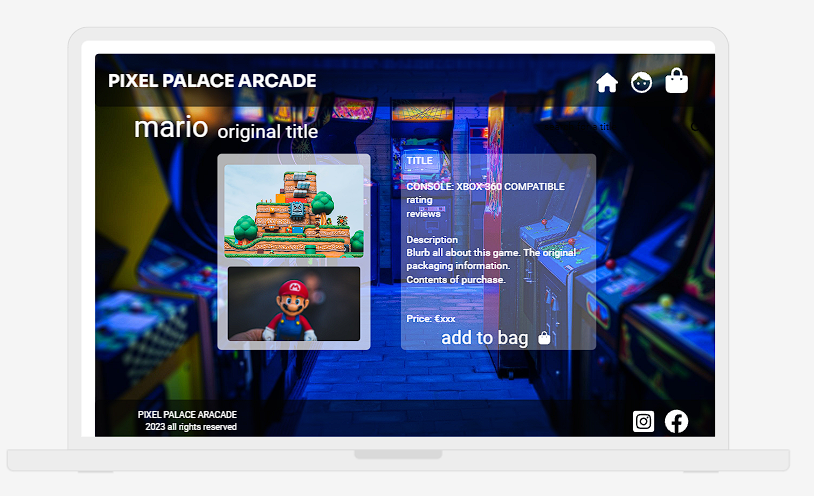
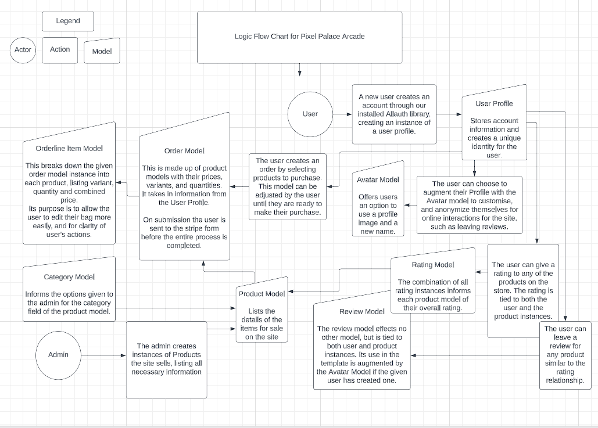
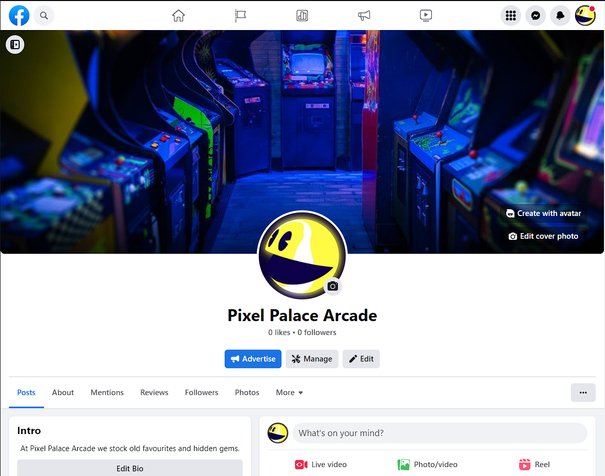

# Pixel Palace Arcade

## Site Purpose

    This is an E-Commerce application that utilises Python's Django framework and implements Stripe Payment Systems. In particular the site is a retro games store and is designed to sell gaming merchandise. Users can review products and create avatar profiles for their online presence through the store. 

## E-Commerce Business Model for Pixel Palace Arcade 

    My focus is on creating a seamless and user-friendly platform for individual customers who are interested in purchasing gaming products.  

    This is a B2C, business to customer model. 

    

    Here are the core intents and marketing strategies that I will implement: 

    

    Core Business Intents:  

    a. Product Catalogue: I will curate a comprehensive catalogue of gaming products, including video games, consoles, accessories, and merchandise. I will ensure that the catalogue is well-organized, up-to-date, and easy to search, providing a smooth browsing experience for my customers.  

    b. User Reviews and Ratings: I will enable customers to rate and review the items they have purchased. By incorporating user-generated content, I aim to help other customers make informed decisions while also establishing credibility and trust for my website.  

    c. Seamless Purchasing Experience: I will prioritize the design of a user-friendly and intuitive interface that simplifies the purchasing process. Implementing secure payment gateways and offering multiple payment options will cater to customer preferences and enhance their buying experience.  

    d. Order Management: Streamlining order processing, tracking, and fulfilment will be a priority. By implementing a robust inventory management system, I can ensure timely delivery and customer satisfaction, avoiding issues like overselling or running out of stock.  

    e. Customer Support: I will offer responsive customer support channels, such as email, live chat, or phone, to promptly address any inquiries, concerns, or issues my customers may have. Delivering excellent customer service will contribute to positive reviews and encourage repeat business. 

    

    Marketing Strategies:  

    a. Targeted Advertising: I will identify my target audience, such as gamers, and utilize digital marketing techniques like search engine optimization (SEO), pay-per-click (PPC) advertising, and social media marketing to reach and engage potential customers.  

    b. Influencer Partnerships: Collaborating with influential gamers, streamers, or content creators who can promote my products to their audience through sponsored content, reviews, or giveaways will boost brand visibility and credibility.  

    c. Email Marketing: Building an email subscriber list will allow me to send regular newsletters or promotional campaigns, keeping customers informed about new game releases, discounts, or special offers. I will personalize the content based on customer preferences and purchase history.  

    d. Loyalty Programs: Implementing a loyalty program will reward frequent customers. By offering incentives like exclusive discounts, early access to new releases, or loyalty points for future purchases, I can encourage customer retention and foster brand loyalty.  

    e. Social Proof and User-generated Content: I will encourage customers to share their purchases on social media platforms, incentivizing them with giveaways or featuring them on my website. This strategy will create social proof, increasing brand visibility and attracting more customers. 

    I will continuously adapt and refine my business model and marketing strategies based on customer feedback and market trends. Regularly monitoring and analyzing key performance indicators (KPIs) will help me measure the effectiveness of my strategies and make data-driven decisions for continuous improvement. 

 

## Agile Development
    The agile development process has been documented through github's projects boards:
    https://github.com/users/OisinWrites/projects/7

## Design UX/UI

### Design overhaul

Inspiration 
https://www.wix.com/blog/best-website-designs
https://www.dopplepress.com/
https://www.yantra.com.sg/
https://www.clarityincrazy.com/

### Wireframes

| Home | Products | Item Page |
|------|----------|-----------|
||||

### Responsivity

| Mobile | Tablet |
|--------|--------|
| |  |

| Laptop |
|--------|
|  |

| Desktop |
|---------|
|  |

### Logic
#### Database Schema of Django Models

        Python logic flowcharts

        

## Search Engine Optimization 

### SEO Project Challenge

    1. What do your users need?

    * Users need a wide selection of retro games, consoles, and accessories.
    * They need clear and detailed product information, including condition, compatibility, and pricing.

    2. What information and features can you provide to meet those needs?

    * I could provide a comprehensive catalog of retro games, consoles, and accessories with high-quality images, descriptions, and specifications.
    * I could include pricing details, availability status, and user reviews/ratings to help users make informed decisions.
    * I could offer multiple shipping options, estimated delivery times, and transparent return policies.
    * I could provide various payment methods and secure checkout options to facilitate smooth transactions.
    * I could offer customer support channels, such as live chat, email, or a dedicated support page, to address any inquiries or issues.

    3. How can you make the information easy to understand?

    * By using clear and concise language in the product descriptions, avoiding jargon or technical terms.
    * Organize my site's layout in a user-friendly manner, with intuitive navigation and categorized sections for easy browsing.
    * Utilize user-friendly filters and sorting options to allow users to quickly find what they're looking for.
    * Provide visual cues, such as icons or badges, to highlight key information like item condition or compatibility.
    * Include FAQ sections and helpful guides to address common questions and assist users in understanding retro gaming terminology or concepts.

    4. How can you demonstrate expertise, authoritativeness and trustworthiness in your content?

    * Feature expert reviews or recommendations from trusted sources in the gaming community.
    * Showcase certifications or partnerships with reputable gaming organizations or manufacturers.
    * Provide detailed information about the company's history, mission, and the expertise of our team.
    * Incorporate user testimonials and reviews to showcase positive experiences from previous customers.
    * Include a secure SSL certificate and display trust badges to assure users that their transactions are safe and their data is protected.

    5. Would there be other pages within your own site you could link to from your chosen page?

    * Yes, you could link to pages like "About Us" to provide information about the company, "FAQ" to address common queries, "Shipping & Returns" for policies, and "Contact Us" for customer support.

    6. Are there opportunities to link back to external websites that already rank highly on Google?

    * I could provide links to reputable retro gaming communities, gaming news websites, or relevant industry forums to provide additional resources and build credibility, ensuring that the external sites are trustworthy and add value to the users.

    7. How can you help users discover other relevant parts of your web application?

    * Include related product recommendations or a "You may also like" section based on users' browsing and purchase history.
    * Implement a search feature that suggests related products or popular searches as users type.
    * Provide a "Featured Items" section or a curated collection of products to highlight new arrivals, bestsellers, or special promotions.
    * Utilize breadcrumbs or a clear navigation menu to allow users to easily navigate between different categories or sections of your website.
    * Implement a personalized user account system where users can save favorite items, create wishlists, or track their order history, encouraging them to explore more parts of the site.

| KEY WORDS | KEY PHRASES |
|-----------|-------------|
|  |  |

Search term hits according to WordTracker: Keyword research tool
https://www.wordtracker.com/

It seems that gaming gifts could be confusing as game of thrones was likely to be returned in search results. But retro games had good hits, unfortunately its next strongest hits were for 'stores near me', and a online store we can't avail of that key term without diminishing the sites credibility.

Searching just the key word "game" showed interesting results that could be incorporated into our site.

| Gaming themed gifts | Retro gaming | Games |
|-----------|-------------|----------|
|  |  |  |

This term, "Where to buy retro gaming accessories online", returned a website with the exact same purpose as Pixel Palace Arcade. Though ours looks much more inviting.

| The Retro Gaming Store |
|------------------------|
|  |
|  |

Googling our own store name once deployed to heroku got some shocking results.
It turn out that these is an incredibly similar site to our own, only they're better as there's a bar.
| |
|-------------------------|

### Alternative Site Names

Having found a business with a remarkably similar name, I undertook some research into google search results for alternative names. After a dozen alternative ideas proved to be taken already I decided to keep the store name for now, rather than settle for a knock-off derivative version. Though I would have liked 'Pixel Perfect Arcade'. 
Additionally some names proved unsuitable, particularly 'Pixel Pocket Arcade', which would mislead customers into thinking our site sold handheld games and devices, which, though it could, it currently does not.
        
| 8-Bit Bazaar | Pixel Emporiium | Pixel Odyssey | Pixel Palladium |
|--------------|---------------|--------------|---------------|
|  ||||

| Retro Relics | Pixel Potatos | Pixel Planet | Pixel Perfect |
|--------------|---------------|--------------|---------------|
|  ||||

| Pixel Paradise | Pixel Parlour | Pixel Pocket | Pixel Pavillion |
|--------------|---------------|--------------|---------------|
|  ||||

    Strongest Key Words and Phrases

    * Classic Arcade Games
    * 8-bit gaming merchandise
    * Nintendo Collectibles
    * Cool math games
    * Where to buy retro gaming accessories online
    * Best websites for vintage video games and collectibles
    * Unique gaming-themed gifts for gamers
    * Authentic gaming memorabilia for sale

    Implemementation in the HTML

        Primary target for keyword replacement is the base.html, and the main nav / mobile top header includes, as they will show up across almost all pages of our site.
        First I've created the meta tags to directly tell the search engine about our site before it has to crawl the pages.
    <meta name="description"
    content= "The best website for arcade video games, gamer gifts, and classic
    gaming-themed merchandise">
    <meta name="keywords"
    content="Classic Arcade Games, 8-bit gaming merchandise, Nintendo Collectibles,
    Cool math games, Where to buy retro gaming accessories online, Best websites for vintage video games and collectibles,
    Unique gaming-themed gifts for gamers, Authentic gaming memorabilia for sale">
    Changing the category tabs to more descriptive alternatives

| Old Navigation Menu | Navigation Menu for SEO |
|---------------------|-------------------------|
|  |  |

I've used the "Cool Math Games" key phrase in the updated description of our Sudoku product, as this is the only approriate place for that strong search term.
Additionally all product images for the site have descriptive and appropriate file names.

|||
|----------------------|----------------|

## Web Marketing

### Facebook 
Our social media page for Pixel Palace Arcade
https://www.facebook.com/people/Pixel-Palace-Arcade/100093332865500/

| Facebook page| A Post on our Feed |
|--------------|--------------------|
|  |  |

### Mailchimp
We signed up to Mailchimp and successfully sent an email campaign to advertise our site.
| Email from Mailchimp |
|----|
|  |

## Features

Feedback for user actions.
The site gives feedback for user actions through message systems.

The admin can edit existing products on the site from the front end

Users get an email notification for a successful purchase and when the admin marks the order as shipped.

Users can view their past orders and reviews, and they can see and edit their avatar.

For the admins pending orders page, the full order number and address are viewable on hover.
Good for use of space and for privacy.

Custom error 404 page for enhanced user experience, and immersion.

## Testing

### Stripe

### Automated tests in development for all views.py logic for apps

Bag

Blog

Checkout

Products

Profiles

### Error Log

    1. In connecting static files, specifically base.css into the base.html file the line {5 static 'css/base.css' %} throws back an error requesting missing endblock.
    2. Stackoverflow suggests moving the static directory under the app, opposed to the example project boutique_ado. And additionally directing to the new file location in settings. However this has not solved issue.
    3. Solution: Base.html was missing load static , whether this should have been performed by the existing same line in index.html after extending base or otherwise, the mock server is now functioning as desired.

    1. Styling was incomplete when viewing site with runserver.
    Base.css was clearly attached correctly, as background image evident, however text is blue, and background div for delivery message unaffected.
    2. I was not using the important override for specificity correctly, and had omitted the exclamation mark prefix from the code.
    3. Corrected styling/targeting error and page is working correctly. 

    1. Need to find correct way to target my image files in media from a django admin panel for products models. Currently the image file is clicked and dropped.
    2. Admin panel sought to add chosen file from coomputer folders, but saved chosen file in media directory. Allowed admin system to drop them there for it to find, rather than force it to pick up from there, where they were already. Likely though, that I was entering the url wrong, which the panel kept insisting was an invalid format.

    1. The badge span to indicate selected categories for shown products list is not inverting colour on hover.
    2. This resolved after pushing, exiting, and reentry.

    1. The sorting text is not updating with the current search from the nav bar.
    2. The code in the html was fine, but the view, on line 46, had the words sort and direction in regular brackets instead of the necessary curlies.

    1. Added script, styling, and html div for a button to bring viewer to the top of a products page. However, thoguh the button should float at the bottom right of the screen, it is static at the bottom of the page, after all products.
    2. After running server and using inspect tool, it is evident the the div is not picking up it the styling from css.
    3. Like the previous issue, this one resolved itself on shutting down gitpod and rebooting. Must be missing a command to refresh or update environmental server manually.
    4. Note to self: Turn it off and on again before staring at code for an hour.

    1. In checkout, the payment field in the form is not working. This may be because we 're not activated on Stripe in our account.

    1. The error messages for the stripe form float on top of the nav banner.

    1. The images for products are called on from the database, not the cloud file storage. In the project example, boutique ado, these images are used as fixtures. Is there a way I can have the product models find their relevant picture from the cloud instead?
    2. The heroku app was not displaying any model instances. I used the command "python manage.py dumpdata > data.json" to create the fixtures file that the example project used, and then loaded this to the external database.
    3. The sqlite database is now replicated in Elephantsql.

    1. The Heroku app isn't picking up the custom allauth templates.
    2. It was they just weren't customised. The local was signed in, the heroku was not. On larger screens, the options while not logged in are unstyled, at a default blue. This needs to be addressed.

    1. Crispy forms won't let users sign in or sign up. The form's submission button has no effect. Verified by logging into the django admin screen.
    2. Changed all instances of form elements to correct crispy syntax which was changing the styling without bringing the functionality.

    1. Stylings outside of base.css were not present on deployed heroku app, but were present on server from development environment.
    2. Included the cloudinary links to specific css folders beneath local static links in templates for both checkout and profile apps.

## Deployment

### Local Deployment on Github
! As a django project however Github is not able to deploy this site. !

Open your web browser and go to the GitHub website: https://github.com.

Log in to your GitHub account if you haven't already.

In the GitHub search bar, enter the name of your repository and press Enter to search for it.

From the search results, click on your repository's name to open it.

Once you are inside your repository, you will see several tabs near the top of the page, such as "Code," "Issues," "Pull requests," etc.

Look for the "Settings" tab on the right side of the tabs, usually located towards the right-hand side of the screen. Click on it to open the repository settings.

Scroll down until you find the "GitHub Pages" section.

In the "GitHub Pages" section, you can choose the branch from which you want to deploy your pages. By default, it is set to the "main" branch.

Next to the branch selection, you will see a dropdown menu with two options: "None" and "master" (or another branch name if you've chosen a different one). Click on the dropdown menu and select the branch you want to use.

Once you've selected the branch, the page will refresh, and you will see a notification indicating the URL where your pages are published. It may take a few moments for the initial deployment to complete.

Click on the URL provided in the notification or go back to the "GitHub Pages" section, and you will find the URL listed there. This is the live link to your deployed pages.

### Deployment on Heroku

Log into Heroku account. Click "NEW" on the Dashboard, select "Create new app" from the drop-down. Give the app a unique name, and click "Create app" to confirm.

Log into ElephantSQL. Click "Create New Instance" on the Dashboard. Give your new plan a Name, select the Tiny Turtle (free) plan, the Tags field can be left blank. Select Region: EU-West-1 (Ireland). Then click "Review", confirm details, and click "Create instance".

Return to the ElephantSQL Dashboard and click "database instance name" for this project, in the URL section, click the copy icon to copy the database URL.

In the project workspace create a env.py file, ensure this is listed in the .gitignore file. In the env.py file write import os. After a blank line type: os.environ["DATABASE_URL"] = "". This will need a secret key as Django application so beneath the url type: os.environ["SECRET_KEY"] = "any_secret_key". And save the file.

In settings.py add the followng code to the Path import: import os import dj_database_url if os.path.isfile('env.py'): import env A little further down, remove the insecure secret key provided by Django. Instead, we will reference the variable in the env.py file, so change your SECRET_KEY variable to the following: SECRET_KEY = os.environ.get('SECRET_KEY'). Next in settings.py, where you find the following: DATABASES = { 'default': { 'ENGINE': 'django.db.backends.sqlite3', 'NAME': BASE_DIR / 'db.sqlite3', } } Replace with: DATABASES = { 'default': dj_database_url.parse(os.environ.get("DATABASE_URL")) }

Save the settings file and run the terminal command "python3 manage.py migrate". Follow this up and add, commit, push the project to gihub.

Return to the Heroku Dashboard and select the Settings tab. Add some config vars: DATABASE_URL with the value of the copied url from ElephantSQL, SECRET_KEY with value of the secret create in env.py file. PORT with value of 8000.

To connect Cloudinary to the Heroku project, set up a free account on Cloudinary. On the Cloudinary dashboard select Copy To Clipboard next to API Environment Variables.

In the env.py file, add at the bottom, os.environ["CLOUDINARY_URL"] = "Value copied less the beginning part of CLOUDINARY_URL=" Copy this value again without the prefix and return to Heroku settings, Config Vars.

Add new Config Var: CLOUDINARY_URL with value of copied text.

In settings.py under INSTALLED_APPS: above 'django.contrib.staticfiles', add 'cloudinary_storage', below 'django.contrib.staticfiles', and 'cloudinary'.

Near the end of settings file below STATIC_URL = '/static/' add STATICFILES_STORAGE = 'cloudinary_storage.storage.StaticHashedCloudinaryStorage' STATICFILES_DIR = [os.path.join(BASE_DIR,'static')] STATIC_ROOT = os.path.join(BASE_DIR, 'staticfiles')

MEDIA_URL = '/media/' DEFAULT_FILE_STORAGE = 'cloudinary_storage.storage.MediaCloudinaryStorage'

At the top of settings.py, under BASE_DIR type TEMPLATES_DIR = os.path.join(BASE_DIR, 'templates')

Scroll to half way down to TEMPLATES =, and in the 'DIRS': [] line, between the square brackets type TEMPLATES_DIR.

Scroll back up, and below DEBUG = True, skip a line and type: ALLOWED_HOSTS = ['herokuappname.herokuapp.com', 'localhost']

Create three directories in the top level, next to manage.py file: templates, media, and static. Additionally create a Procfile. Inside the Procfile add the line: web: gunicorn appname.wsgi

Save, add, commit, and push the project.

In the Heroku Dashboard, click on the Deploy tab, click on the option to Deploy through Github, this may need to be set up if its your first time. Search your repositories for the project. Scroll to the bottom of the page and select Deploy Branch.

## Credits

    * Coin Logo for header: https://www.pngegg.com/en/png-ertzr

    * Background Image: https://www.ripleys.com/

    * Live Wallpaper: https://rare-gallery.com/95641-retro-arcade-room.html

    * Image used for texture: https://www.vecteezy.com/photo/19927262-old-paper-texture-and-background-vintage

    * 404 Image: https://www.istockphoto.com/

    * High-res 'HAL 9000' from '2001, A Space Odyssey', Kubrick, 1968: https://wallpapersafari.com/w/DYZ94J

    * Favicon: http://onlinefavicon.com/

    * Avatar Example Image: https://www.iconfinder.com/ & https://icon-library.com/

    * Icons used throughtout project: https://fontawesome.com/

    * Much of the product is based on the Code Institute walkthrough project.

    But I want to give particular acknowledgement to the Boutique Ado project for the following areas of my project submission.

    Full Stripe implementation.

    Sort and Search functionality for products.

    The majority of both the bag and checkout apps, which have been implemented in my project and remain largely unaltered.

