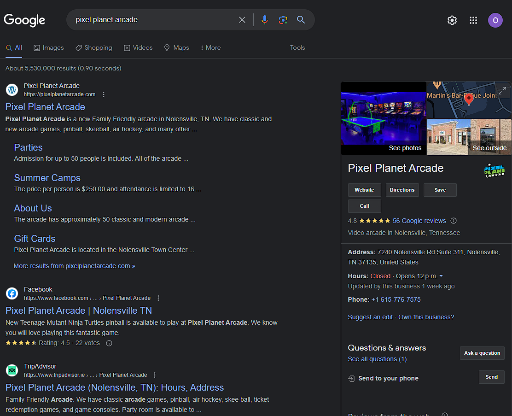

# Pixel Palace Arcade

## Site Purpose
This is an E-Commerce application that utilises Python's Django framework and implements Stripe Payment Systems. In particular the site is a retro games store and is designed to sell gaming merchandise. Users can review products and create avatar profiles for their online presence through the store. 

## Agile Development
The agile development process has been documented through github's projects boards:
https://github.com/users/OisinWrites/projects/7

## Design 

    UX/UI
        Wireframes
        Colour choice
        Image Selection
        Font choices

    Logic
        Class Models
        Python logic flowcharts
        

## Search Engine Optimization 

### SEO Project Challenge

    1. What do your users need?

    * Users need a wide selection of retro games, consoles, and accessories.
    * They need clear and detailed product information, including condition, compatibility, and pricing.

    2. What information and features can you provide to meet those needs?

    * I could provide a comprehensive catalog of retro games, consoles, and accessories with high-quality images, descriptions, and specifications.
    * I could include pricing details, availability status, and user reviews/ratings to help users make informed decisions.
    * I could offer multiple shipping options, estimated delivery times, and transparent return policies.
    * I could provide various payment methods and secure checkout options to facilitate smooth transactions.
    * I could offer customer support channels, such as live chat, email, or a dedicated support page, to address any inquiries or issues.

    3. How can you make the information easy to understand?

    * By using clear and concise language in the product descriptions, avoiding jargon or technical terms.
    * Organize my site's layout in a user-friendly manner, with intuitive navigation and categorized sections for easy browsing.
    * Utilize user-friendly filters and sorting options to allow users to quickly find what they're looking for.
    * Provide visual cues, such as icons or badges, to highlight key information like item condition or compatibility.
    * Include FAQ sections and helpful guides to address common questions and assist users in understanding retro gaming terminology or concepts.

    4. How can you demonstrate expertise, authoritativeness and trustworthiness in your content?

    * Feature expert reviews or recommendations from trusted sources in the gaming community.
    * Showcase certifications or partnerships with reputable gaming organizations or manufacturers.
    * Provide detailed information about the company's history, mission, and the expertise of our team.
    * Incorporate user testimonials and reviews to showcase positive experiences from previous customers.
    * Include a secure SSL certificate and display trust badges to assure users that their transactions are safe and their data is protected.

    5. Would there be other pages within your own site you could link to from your chosen page?

    * Yes, you could link to pages like "About Us" to provide information about the company, "FAQ" to address common queries, "Shipping & Returns" for policies, and "Contact Us" for customer support.

    6. Are there opportunities to link back to external websites that already rank highly on Google?

    * I could provide links to reputable retro gaming communities, gaming news websites, or relevant industry forums to provide additional resources and build credibility, ensuring that the external sites are trustworthy and add value to the users.

    7. How can you help users discover other relevant parts of your web application?

    * Include related product recommendations or a "You may also like" section based on users' browsing and purchase history.
    * Implement a search feature that suggests related products or popular searches as users type.
    * Provide a "Featured Items" section or a curated collection of products to highlight new arrivals, bestsellers, or special promotions.
    * Utilize breadcrumbs or a clear navigation menu to allow users to easily navigate between different categories or sections of your website.
    * Implement a personalized user account system where users can save favorite items, create wishlists, or track their order history, encouraging them to explore more parts of the site.

| KEY WORDS | KEY PHRASES |
|-----------|-------------|
|  |  |

Search term hits according to WordTracker: Keyword research tool
https://www.wordtracker.com/

It seems that gaming gifts could be confusing as game of thrones was likely to be returned in search results. But retro games had good hits, unfortunately its next strongest hits were for 'stores near me', and a online store we can't avail of that key term without diminishing the sites credibility.

Searching just the key word "game" showed interesting results that could be incorporated into our site.

| Gaming themed gifts | Retro gaming | Games |
|-----------|-------------|----------|
|  |  |  |

This term, "Where to buy retro gaming accessories online", returned a website with the exact same purpose as Pixel Palace Arcade. Though ours looks much more inviting.

| The Retro Gaming Store |
|------------------------|
|  |
|  |

Googling our own store name once deployed to heroku got some shocking results.
It turn out that these is an incredibly similar site to our own, only they're better as there's a bar.
| |
|-------------------------|

### Alternative Site Names

Having found a business with a remarkably similar name, I undertook some research into google search results for alternative names. After a dozen alternative ideas proved to be taken already I decided to keep the store name for now, rather than settle for a knock-off derivative version. Though I would have liked 'Pixel Perfect Arcade'. 
Additionally some names proved unsuitable, particularly 'Pixel Pocket Arcade', which would mislead customers into thinking our site sold handheld games and devices, which, though it could, it currently does not.
        
| 8-Bit Bazaar | Pixel Emporiium | Pixel Odyssey | Pixel Palladium |
|--------------|---------------|--------------|---------------|
|  ||||

| Retro Relics | Pixel Potatos | Pixel Planet | Pixel Perfect |
|--------------|---------------|--------------|---------------|
|  ||||

| Pixel Paradise | Pixel Parlour | Pixel Pocket | Pixel Pavillion |
|--------------|---------------|--------------|---------------|
|  ||||

    Strongest Key Words and Phrases

* Classic Arcade Games
* 8-bit gaming merchandise
* Nintendo Collectibles
* Cool math games
* Where to buy retro gaming accessories online
* Best websites for vintage video games and collectibles
* Unique gaming-themed gifts for gamers
* Authentic gaming memorabilia for sale

    Implemementation in the HTML

Primary target for keyword replacement is the base.html, and the main nav / mobile top header includes, as they will show up across almost all pages of our site.
First I've created the meta tags to directly tell the search engine about our site before it has to crawl the pages.
<meta name="description"
content= "The best website for arcade video games, gamer gifts, and classic
gaming-themed merchandise">
<meta name="keywords"
content="Classic Arcade Games, 8-bit gaming merchandise, Nintendo Collectibles,
Cool math games, Where to buy retro gaming accessories online, Best websites for vintage video games and collectibles,
Unique gaming-themed gifts for gamers, Authentic gaming memorabilia for sale">
Changing the category tabs to more descriptive alternatives
| Old Navigation Menu | Navigation Menu for SEO |
|---------------------|-------------------------|
|  |  |

I've used the "Cool Math Games" key phrase in the updated description of our Sudoku product, as this is the only approriate place for that strong search term.
Additionally all product images for the site have descriptive and appropriate file names.

|||
|----------------------|----------------|

    Web Marketing

Features

Testing
    Error Log
    1. In connecting static files, specifically base.css into the base.html file the line {5 static 'css/base.css' %} throws back an error requesting missing endblock.
    2. Stackoverflow suggests moving the static directory under the app, opposed to the example project boutique_ado. And additionally directing to the new file location in settings. However this has not solved issue.
    3. Solution: Base.html was missing , whether this should have been performed by the existing same line in index.html after extending base or otherwise, the mock server is now functioning as desired.

    1. Styling was incomplete when viewing site with runserver.
    Base.css was clearly attached correctly, as background image evident, however text is blue, and background div for delivery message unaffected.
    2. I was not using the important override for specificity correctly, and had omitted the exclamation mark prefix from the code.
    3. Corrected styling/targeting error and page is working correctly. 

    1. Need to find correct way to target my image files in media from a django admin panel for products models. Currently the image file is clicked and dropped.
    2. Admin panel sought to add chosen file from coomputer folders, but saved chosen file in media directory. Allowed admin system to drop them there for it to find, rather than force it to pick up from there, where they were already. Likely though, that I was entering the url wrong, which the panel kept insisting was an invalid format.

    1. The badge span to indicate selected categories for shown products list is not inverting colour on hover.
    2. This resolved after pushing, exiting, and reentry.

    1. The sorting text is not updating with the current search from the nav bar.
    2. The code in the html was fine, but the view, on line 46, had the words sort and direction in regular brackets instead of the necessary curlies.

    1. Added script, styling, and html div for a button to bring viewer to the top of a products page. However, thoguh the button should float at the bottom right of the screen, it is static at the bottom of the page, after all products.
    2. After running server and using inspect tool, it is evident the the div is not picking up it the styling from css.
    3. Like the previous issue, this one resolved itself on shutting down gitpod and rebooting. Must be missing a command to refresh or update environmental server manually.
    4. Note to self: Turn it off and on again before staring at code for an hour.

    1. In checkout, the payment field in the form is not working. This may be because we 're not activated on Stripe in our account.

    1. The error messages for the stripe form float on top of the nav banner.

    1. The images for products are called on from the database, not the cloud file storage. In the project example, boutique ado, these images are used as fixtures. Is there a way I can have the product models find their relevant picture from the cloud instead?
    2. The heroku app was not displaying any model instances. I used the command "python manage.py dumpdata > data.json" to create the fixtures file that the example project used, and then loaded this to the external database.
    3. The sqlite database is now replicated in Elephantsql.

    1. The Heroku app isn't picking up the custom allauth templates.
    2. It was they just weren't customised. The local was signed in, the heroku was not. On larger screens, the options while not logged in are unstyled, at a default blue. This needs to be addressed.

    1. Crispy forms won't let users sign in or sign up. The form's submission button has no effect. Verified by logging into the django admin screen.
    2. Changed all insstances to {{ form|crispy }} instead of , which was changing the styling without bringing the functionality.

    1. Stylings outside of base.css were not present on deployed heroku app, but were present on server from development environment.
    2. Included the cloudinary links to specific css folders beneath local static links in templates for both checkout and profile apps.

    Validation and Accessibility

Deployment

Credits

Favicon: http://onlinefavicon.com/
Stripe implementation: CI Boutique Ado project

Project Process
1. Install Django, create app and superuser. Created .gitignore file for app.
2. Begin ReadMe with section headings.
3. Create project in github for agile stories, set to public, linked to repository.
4. Install Allauth, make necessary changes to settings, and create url path.
5. Migrate app, runserver, sign in with superuser info.
6. Edit site name, for easier authentication later with social media apps.
7. Create email backend and sign in/up settings in settings.py.
8. Create requirements.txt with pip freeze.
9. Open email address in admin models and select verify and primary for admin email.
10. Make templates, and allauth, directories.
11. Copy template directories from allauth to folders made in last step.
12. Create base.html under templates directory. Copy boilerplate from bootstrap.
13. Add meta lines, move script up, add load static.
14. Wrap sections in  blocks.
15. Create home app. Create templates, views, urls for index page and test.
16. Created seperate files for the navbar, and for mobile navbar and included into base.html.
17. Created categories and subcategories for products with anchors to be filled in.
18. Added product images to media
19. Created app Products, copied json fixtures- categories and products.
20. Created models for Categories and Products and made migrations.
21. Registered new models in admin.py file.
22. Installed Pillow and updatedd requirements.txt
23. Ran command python3 manage.py loaddata categories. Had to run migrate cmnd prior. Installed 9 objects successfully.
24. Removed fixtures as that is prior gathered data for boutique ado project. Instead, build product list from scratch in admin panel.
25. Add views for products
26. Customise admin via admin.py for abiltiy to sort and search.
27. Create a view function for products details, url, and template.
28. Add functionality to search bar using django database model: Q
29. Add functionality to sort items by category, price, rating.
30. Create bag app to handle the shopping bag function.
31. Create a context.py file to handle the bag across any other template. Update settings for templates, and add delivery threshold and percentage.
32. Give content to bag view.
33. Using shell command update models to include boolean toggle for variants on selected categories.
34. In product details add content to select console for games.
35. Have label for variant render in shopping bag or else N/A.
36. Refine quantity selection in details and bag templates.
37. Give messages to the user to affirm actions..
38. Create checkout app once bag is finished.